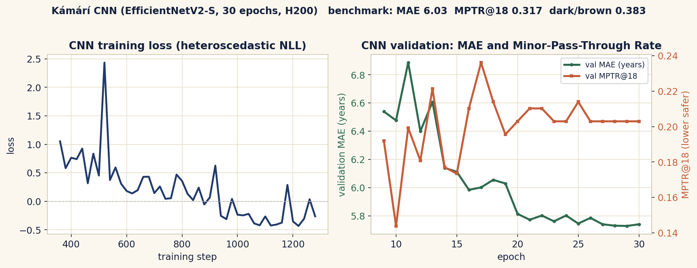
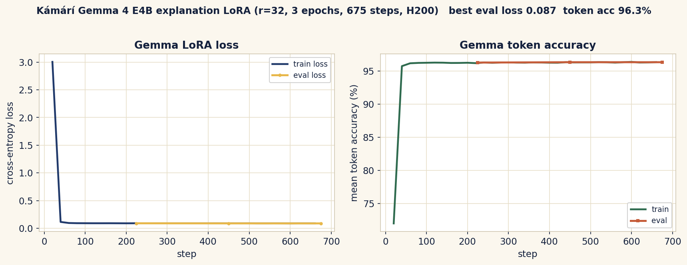

# Kámárí Methodology (v0)

How the Kámárí dataset, CNN age model, and Gemma explanation model are built, trained, and
evaluated. All numbers are from the trained v0 run (Hugging Face namespace `Shinzmann`).

## 1. Data pipeline (one Colab notebook)
`notebooks/kamari_data_pipeline_v4_new_fast.ipynb` runs gather, clean, preprocess, EDA, and publish
in a single pass, then pushes datasets to Hugging Face so the Modal training scripts can pull them.

**Sources.** Open, license-checked face datasets, classified by role in
`data/registry/datasets_free_open.yaml` and `dataset_sources.yaml`:
- Exact-age training: UTKFace, APPA-REAL, AgeDB, FG-NET (verified exact-age parsers).
- African-domain signal: FAGE_v2 (African public figures, 10 countries), FairFace Black subset.
- Auxiliary / pretrain: All-Age-Faces, IMDB-WIKI, AxonData.
- Benchmarks: FairFace, RFW, BFW, AgeDB-30 (fairness and verification slices).
- Excluded: MS-Celeb-1M (consent withdrawn). Request-only African sets (CASIA-Face-Africa, BVC-UNN,
  NEFI) are recorded as access gaps, not silently dropped.

**Auto label-quality gate.** Only `{UTKFace, APPA-REAL, FG-NET}` skip the gate. Every other dataset
with enough aged rows is flagged SUSPECT (and its ages voided) if any of: more than 15% of ages
under 5, max age under 13, 12 or fewer unique ages (categorical), or mean age under 12. This catches
datasets that encode an ID or a bracket in the age field (which previously created "fake toddlers").
The same guard runs again at train time in `train_cnn.py`.

**Preprocessing.** MTCNN face detection, eye-alignment, center crop with 0.35 margin, resize to
224x224. Aligned datasets skip detection. A quality score (0.7 x sharpness + 0.3 x brightness) drops
crops below 0.30. Skin tone is estimated via the Individual Typology Angle (ITA) in CIE-Lab and
bucketed into bands (very_light to dark). ImageNet normalization.

**Split.** Leakage-free holdout keyed by `subject_id` (else `image_id`), 15% held out; train and
benchmark are made strictly disjoint by both image and subject id (EDA asserts zero overlap).

**Composition (v0, `manifest_summary.json`).** candidate 825,129 rows, kept 480,828; exact-age
training 24,753; African-signal 10,182; 13 to 21 boundary 3,139; 12 datasets downloaded. Crops go to
a private HF repo only; manifests store paths, hashes, and labels, never pixels. Minor faces are
never published publicly.

## 2. CNN age model
`services/modal_age/train_cnn.py`.

- **Backbone:** EfficientNetV2-S (`tf_efficientnetv2_s`, ImageNet-pretrained).
- **Heads:** age regression, under-18 logit, and a heteroscedastic log-variance (aleatoric
  uncertainty).
- **Loss:** heteroscedastic Gaussian NLL for age + BCE for the minor head.
- **Sampling:** a composite `WeightedRandomSampler` over `age_band x skin_band` strata, inverse
  frequency, with a 3x boost for ages 13 to 21 (the safety boundary) and 1.5x for brown and dark
  skin (fairness).
- **Augmentation:** random resized crop, horizontal flip, small rotation, mild brightness/contrast
  jitter. No hue/saturation jitter (would corrupt age and skin signal).
- **Training:** 30 epochs, batch 512, AdamW (lr 3e-4, wd 1e-4), cosine schedule with warmup, bf16 +
  TF32 + channels_last, on an H200 (about 15 minutes wall-clock; the full run is tracked in Weights
  & Biases, project `kamari`). 22,224 train / 2,529 val exact-age rows. Per-epoch checkpointing
  (resumable). Model selection minimizes a safety composite `score = MAE + 5 x MPTR@18`.
- **Export:** ONNX (opset 17) plus the PyTorch checkpoint. W&B logging when configured.

**Results (held-out, n=8,322).** MAE 6.03; MPTR@18 0.317 (dark+brown 0.383); MPTR@21 0.27;
adult-block 0.01. MAE by skin: very_light 5.46, light 5.72, intermediate 5.50, tan 5.99, brown 6.23,
dark 6.58. MAE by age band rises at the extremes (0-12: 4.04, 21-25: 4.30, 51+: 8.51). Validation
MAE 5.73 / MPTR@18 0.20. GPU eval latency p50 14.2 ms.

**Reading the results.** MAE is competitive, but MPTR@18 (minors passed as adults) is too high for
the CNN to gate alone. Kámárí treats the CNN as a signal, not a verdict: the policy engine is
conservative through the 18 to 21 band, low-confidence and borderline cases route to liveness or a
guardian check, and MPTR is the metric we optimize against.

**Training curves** (from the W&B run; raw history in `docs/assets/training/cnn_history.csv`):

## 3. Policy engine
Ordered, fail-safe rules (thresholds: block p(under-18) 0.70, challenge age 21, uncertainty 0.28,
min quality 0.40):
1. quality < 0.40 -> `RECAPTURE_LOW_QUALITY`
2. p(under-18) >= 0.70 -> `BLOCK_LIKELY_MINOR`
3. estimated age < 21 -> `SECONDARY_CHECK_NEAR_THRESHOLD` (buffer above the legal 18)
4. uncertainty > 0.28 -> `SECONDARY_CHECK_LOW_CONFIDENCE`
5. else -> `ALLOW`

## 4. Gemma explanation model
`services/modal_gemma/train_gemma.py`, `training/gemma/build_sft_dataset.py`.

- **Base:** `google/gemma-4-E4B-it`, QLoRA (4-bit nf4, double quant), LoRA r=32, alpha 64, dropout
  0.05, `target_modules="all-linear"` (Gemma 4 wraps projections in a clippable-linear layer that
  named targets cannot reach).
- **SFT data:** synthesized from the policy engine, not from child faces. Sampled signals run through
  the same `decide()` rules; approved per-reason, per-language templates render the message. The set
  is reason-code balanced (so it is not dominated by ALLOW) across languages (en, sw, yo, ha, am, fr,
  ar). 8,000 rows, 7,200 train / 800 eval.
- **Training:** 3 epochs, effective batch 32 (8 x 4 accum), lr 2e-4 cosine, max length 512, gradient
  checkpointing, NEFTune, packing off, on an H200.
- **Output:** strict JSON with `decision, reason_code, user_message, admin_summary, next_step,
  language, safety_note` (`training/gemma/output_schema.json`). Gemma chooses reason codes from a
  fixed list and never invents one; it never estimates age.
- **Decoding:** a manual KV-cached greedy decode (the multimodal Gemma 4 `generate()` has a
  tensor-shape bug, so it is avoided in both training-eval and serving).

**Eval.** Training loss converged from 3.00 to a best eval loss of 0.087, at 96.3% eval token
accuracy (3 epochs / 675 steps, about 35 minutes on an H200; tracked in Weights & Biases, project
`kamari`). Evaluated through the served endpoint (the manual decode used in production) over n=70 cases across 5 reason codes and 7 languages: JSON
validity 1.00, schema compliance 1.00, decision consistency 1.00, policy consistency 1.00, language
correctness 1.00, invented-code rate 0.00. The endpoint validates and falls back to an approved
template on any model failure, so the system always returns valid, schema-correct, policy-consistent
JSON; language correctness reflects in-language generation. (An earlier eval showed 0.0 because it ran
through the buggy `generate()` path; superseded.) Non-English strings still benefit from a native review.

**Training curves** (from the W&B run; raw history in `docs/assets/training/gemma_history.csv`):

## 5. Serving
- **CNN (CPU, always-on):** loads the PyTorch checkpoint, detects and crops the face with an OpenCV
  Haar cascade (matching the training crops; if no face is found it asks for a recapture), then
  returns raw signals only. Quality is the Laplacian-variance sharpness of the detected face.
- **Gemma (GPU L4, always-on):** loads base + adapter, merges, and uses the manual greedy decode. If
  output fails validation it returns a deterministic safe fallback so the gateway always gets valid
  JSON.

## 6. Safety and privacy
- **MPTR (Minor-Pass-Through Rate)** is the headline metric: the fraction of true minors let through
  as adults, reported overall, at 21, and for dark + brown skin. Weighted 5x in model selection.
- **No image storage.** Serving infers on bytes and returns signals; the selfie is never persisted.
  Gemma never sees the image, only numeric signals and policy context.
- **No raw redistribution.** Manifests store paths and labels, not pixels. Minor faces are never
  published. Verification is 1:1 only.
- Every output carries: this is an estimate, not a legal age determination.
